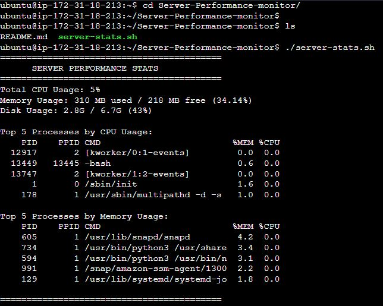

# Server Performance Monitor

A lightweight Bash script developed to monitor and display essential Linux server performance metrics.

---

# 📌 Project Overview

Server Performance Monitor is a Bash-based monitoring tool that collects and displays important system statistics from a Linux server.

The script provides a quick overview of server health by displaying:

- Total CPU Usage
- Memory Usage
- Disk Usage
- Top 5 CPU-consuming processes
- Top 5 Memory-consuming processes

---

# 🎯 Why I Built This Project

As an aspiring DevOps Engineer, understanding Linux server internals is essential.

In real-world production environments, DevOps engineers are responsible for monitoring server health, identifying resource bottlenecks, and troubleshooting performance issues.

I built this project to:

- Strengthen my Linux and Bash scripting skills.
- Understand how Linux exposes system performance data.
- Learn process monitoring and resource utilization.
- Gain hands-on experience with Linux administration tasks.
- Prepare for real-world DevOps responsibilities.

---

# ❓ Problem Statement

System administrators often need a quick way to check server health without installing heavy monitoring solutions.

This script solves that problem by providing an easy-to-use command-line utility that instantly displays important server metrics.

---

# 💡 Project Objectives

The main objectives of this project are:

- Monitor server resource utilization.
- Practice Bash scripting.
- Learn Linux performance analysis.
- Automate routine administration tasks.
- Build a portfolio project for DevOps roles.

---

# 🚀 Features

✅ Display total CPU usage

✅ Show memory usage (Used vs Free)

✅ Display root filesystem disk usage

✅ Display Top 5 processes by CPU usage

✅ Display Top 5 processes by Memory usage

✅ Lightweight and easy to use

✅ Compatible with most Linux distributions

---

# 🛠️ Technologies Used

| Technology | Purpose |
|------------|---------|
| Bash | Automation and scripting |
| Linux | Operating System |
| top | CPU monitoring |
| free | Memory monitoring |
| df | Disk monitoring |
| ps | Process monitoring |
| awk | Data extraction |
| sed | Text processing |
| Cron | Task scheduling |

---

# 📋 Prerequisites

Before running this project, ensure you have:

- Linux-based Operating System (Ubuntu, CentOS, RHEL, Debian)
- Bash shell installed
- Standard Linux utilities installed

---

# 📥 Installation

Clone the repository:

```bash
git clone https://github.com/farazii1159/Server-Performance-monitor.git
```

Move into project directory:

```bash
cd Server-Performance-monitor
```

Make script executable:

```bash
chmod +x server-stats.sh
```

---

# ▶️ Usage

Run the script:

```bash
./server-stats.sh
```

---
Example Output:


```text
==========================================
      SERVER PERFORMANCE STATS
==========================================

Total CPU Usage: 12.5%

Memory Usage: 1500 MB used / 500 MB free (75%)

Disk Usage: 20G / 50G (40%)

Top 5 Processes by CPU Usage:
PID   PPID  CMD                %MEM  %CPU

Top 5 Processes by Memory Usage:
PID   PPID  CMD                %MEM  %CPU
```

---


# ⏰ Automation with Cron

Open crontab:

```bash
crontab -e
```

Add in last line:

```bash
0 * * * * /path/to/server-stats.sh >> /var/log/server-stats.log 2>&1
```

This schedules the script to execute automatically every hour.

---
### 📄 Viewing Logs

To view the generated log file afet every hour:

```bash
cat /home/ubuntu/Server-Performance-monitor/server-stats.log
```


---

# 📁 Project Structure

```text
Server-Performance-monitor/
│
├── server-stats.sh
├── README.md
└── server-stats.log
```
---
`server-stats.log` is a generated file, not part of the source code.
It is automatically created when the cron job runs.
Log files are usually not stored in Git repositories because they are environment-specific and change frequently.

---

# 📚 Key Learning Outcomes

Through this project, I learned:

- Linux System Administration
- Bash Scripting
- Process Monitoring
- Resource Utilization Analysis
- Linux Commands
- Task Automation using Cron
- Server Health Monitoring

---

# 🔮 Future Enhancements

Planned improvements include:

- Add OS version information.
- Add system uptime statistics.
- Generate log files automatically.
- Send email alerts when resource usage exceeds thresholds.
- Containerize the application using Docker.
- Integrate with Prometheus and Grafana.

---

# 🧑‍💼 Interview Explanation

### What is this project?

This is a Bash-based Linux monitoring script that displays important server performance metrics such as CPU, memory, disk usage, and top resource-consuming processes.

### Why did you build this project?

I built this project to improve my Linux administration and Bash scripting skills while gaining practical experience in server monitoring, which is an important responsibility of a DevOps Engineer.

### How does it work?

The script uses native Linux commands like `top`, `free`, `df`, and `ps` to collect system information. It then processes and formats this information using Bash, `awk`, and `sed` before displaying it to the user.

### What challenges did you face?

Since I initially developed the project on Windows using Git Bash, Linux-specific commands such as `top` and `free` were unavailable. I resolved this by deploying and testing the script on an AWS EC2 Linux instance.

### How can this project be improved?

The project can be enhanced by adding alerting mechanisms, centralized logging, Docker support, and integration with monitoring tools like Prometheus and Grafana.

### Why is the log file not included in the repository?

The log file is generated dynamically at runtime by the cron job. Since log files are environment-specific and continuously changing, they are excluded from version control using `.gitignore.`


---

## 👨‍💻 Author

**Faraz Shabbir**

Aspiring DevOps Engineer | Linux Enthusiast | Bash Scripting Learner | Cloud Engineer

LinkedIn: https://www.linkedin.com/in/faraz-shabbir-5a9227344/

---
